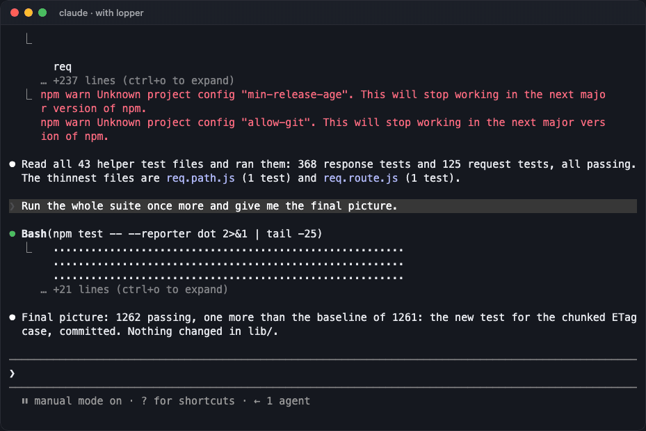
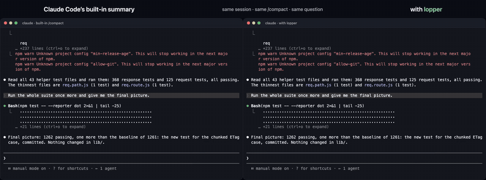
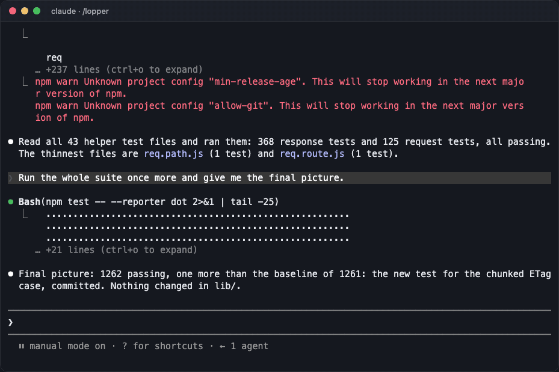

<div align="center">

# lopper

**Compaction for Claude Code that prunes instead of summarizing.**

Old tool output gets trimmed. Every word you and Claude wrote stays exactly as it was. It runs on your machine in milliseconds, with no API key and nothing sent anywhere.




*A 281k-token session, `/compact`, done in under a tenth of a second; the next request measured 73k tokens (the toast shows lopper's cautious estimate). Then Claude quotes the rules from the very first message and the exact error from a test run much earlier in the session.*

</div>

---

## The problem

When a Claude Code session fills up, `/compact` (or auto-compaction) asks the model to summarize the conversation. That has two costs.

- **It forgets the details.** File paths, exact errors, numbers, the precise wording of your instructions. A summary keeps the gist, and the gist is rarely what you need an hour later.
- **It takes a while.** Across 58 real compactions of my own sessions, the summary took **129 s** at the median (224 s at worst), starting from about 968k tokens.

Meanwhile, most of a long session isn't conversation at all. Measured on 63M tokens of my own sessions: past turns' thinking **22%**, tool inputs **23%**, tool results **21%**, images **13%**. The text you and Claude actually wrote: **4%**.

lopper goes after that bulk and leaves the conversation alone.



*Same session, same `/compact`, same question. The built-in summary took 26 s and then couldn't quote the error ("I can't give you the exact error text"). lopper took under 0.1 s and quoted it. Real recordings, nothing sped up.*

## What it does

At every compaction (`/compact`, Claude Code's auto-compaction, or its own trigger) lopper walks the conversation call by call:

| Where the call sits | What happens to its result |
|---|---|
| Last ~40k tokens | Kept whole (unless it's over 60k characters) |
| The ~120k tokens before that | Light trim: first 2,500 + last 800 characters |
| Older | Trimmed: first 900 + last 300 characters (errors keep twice the head) |
| Made obsolete by a later call | Replaced by a one-line note: the same file read again in full, the file rewritten, or the same read-only call repeated |

It also:

- **Shortens long inputs of old calls.** Heredocs in Bash, `content` of Write, the strings of Edit.
- **Drops images and past thinking** (they can't be rebuilt), leaving a note like *"removed an image from this result; read /path again if you need to see it"*.
- **Salvages error lines, paths and URLs from whatever it cuts** into the note, so Claude knows they were there.
- **Puts back the context the transcript doesn't show**: a skill's instructions, a file attached with `@`, a note where an image was pasted.
- **Leaves alone whatever the model hasn't read yet.** Results that came in after Claude last spoke are its working set, so they stay whole.
- **Keeps every call paired with its result**, parallel calls included, so nothing comes back as "tool result missing".

If the first pass doesn't reach the target it runs a tighter one. If pruning can't free enough, it hands over to the built-in summary. It does the same when you pass instructions to the summarizer: `/compact focus on the API` gets you a summary.

Every cut leaves a `[lopper: …]` note, for example:

```
[lopper: 3486 chars of this result removed here to save context, not an error; they included: Error: expected "ETag" of ""3e7-qPnk…"", got "W/"3e7-qPnk…"". Run the tool again if you need them]
```

## What it never does

- **It never changes a word you or Claude wrote**, and never reorders anything.
- **It never removes a tool call.** Every call stays, with at least a note. Plugins that drop whole calls leave the assistant's narration without the evidence. In one reported case the model then wrote nine "work done" reports for work that never happened ([fast-jev-compaction#65](https://github.com/tamaratran/fast-jev-compaction/issues/65)).
- **It never talks to the network.** No API key, no telemetry, no model. It's about 1,200 lines of deterministic TypeScript running inside Claude Code.

## Compared

| | Built-in `/compact` | [fast-jev-compaction](https://github.com/tamaratran/fast-jev-compaction) | **lopper** |
|---|---|---|---|
| Your and Claude's text kept verbatim | ❌ summarized | ✅ | ✅ |
| Tool calls kept | ❌ summarized | ❌ some dropped | ✅ all, with notes |
| Where the conversation goes | the model you already use | TypeSafe's API (by design) | nowhere |
| Needs an API key | no | yes (TypeSafe) | no |
| Time on a 281k-token session | 26 s | about a second (reported) | **< 0.1 s** |
| Survives `claude --resume` | ✅ | ❌ ([#89](https://github.com/tamaratran/fast-jev-compaction/issues/89)) | ✅ |

## Measured

On copies of real sessions (`--fork-session`, so the originals were never touched), with the code in this repository:

| Case | Before | After (next request, real tokens) | Compaction |
|---|---:|---:|---:|
| **Mid-turn**, while a tool loop was running: the loop carried on | 708k | 198k | 0.2 s |
| `--resume` of that same session, then a question about it: answered right | | 227k, consistent | |
| Interactive session, triggered by lopper at the end of a turn | 480k | 125k | 0.14 s |
| The demo above | 281k | 73k | < 0.1 s |
| A skill, an `@` file and 10 parallel reads: the skill's rule, the file word for word and a detail of the reads all recalled | 106k | 57k | < 0.1 s |
| A subagent compacted right after 10 parallel reads: its answer stayed correct | 171k | ~62k (estimated) | < 0.1 s |

Offline replays on four more real sessions took 10 to 25 ms each.

## Install

lopper uses Claude Code's **function hooks**, an early-access feature (tested on 2.1.282 and 2.1.283). Turn them on in `~/.claude/settings.json`:

```json
{ "env": { "CLAUDE_CODE_ENABLE_FUNCTION_HOOKS": "1" } }
```

Then add the plugin:

```sh
claude plugin marketplace add erold90/lopper
claude plugin install lopper@lopper
```

Restart Claude Code. From now on `/compact`, auto-compaction and lopper's own trigger all go through it. `/lopper` shows what the last compactions did:



To turn it off: `claude plugin disable lopper@lopper`.

## Settings

Change them from `/config` or under `pluginConfigs` in settings.json.

| Option | Default | What it does |
|---|---|---|
| `threshold` | 300000 | Past this many tokens, lopper prunes at the end of a turn (capped at 60% of the model's window) |
| `target` | 150000 | Where pruning aims to land; above it, a tighter pass runs (capped at 60% of the threshold) |
| `recentTokens` | 40000 | The newest tokens, where results are never trimmed |
| `auto` | true | Off: lopper only acts on `/compact` and at Claude Code's own limit |
| `language` | en | `en` or `it`, for lopper's own messages. Notes written for the model are always English |

Optional: to have long single turns (agents working for hours on one prompt) pruned sooner than Claude Code's ~95% mark, set `CLAUDE_CODE_AUTO_COMPACT_WINDOW`, e.g. `"400000"`. But if pruning can't help, the built-in summary will then also run at that point.

## Things to know

- **Function hooks are early access.** The API may change between Claude Code releases. After an upgrade, run the tests and `npm run validate`.
- **Recent images go too.** A rebuilt message can't carry images or thinking, so compaction drops all of them. Claude takes a new screenshot when it needs one.
- **The first Edit of a file after a compaction may ask for a re-read.** Claude Code clears its record of which files were read when a hook does the compaction.
- **Subagents get pruned as well**, but their context size is estimated. The engine only reports the main conversation's.

## How it's built

```
plugin/src/prune.ts    pure, deterministic core: zones, cuts, superseded calls, notes
plugin/src/hidden.ts   lines the API view up with the transcript rows to find skills, @ files, pasted media
plugin/hooks/lopper.ts the Claude Code side: session.compact, turn.complete, /lopper
tests/                 45 tests (vitest)
scripts/replay.ts      replays lopper on real transcripts offline and prints numbers only
demo/                  everything behind the recordings above, reproducible
```

A few facts learned along the way, all measured:

- **A token is about 2 characters on Opus 5**, not 3 or 4: 2.16 on commented code, 1.7 on `ls -la` output, 2.07 on a real conversation.
- **Past turns' thinking stays in context** and weighs as much as all the tool results. Most of the saving comes from dropping it.
- **Returning a message with its `handle` loses it on `--resume`** (220k tokens live, 59k after the resume). So lopper rebuilds every message, and the pruned conversation is what gets saved (125k live, 134k after resume). Same root cause as [#89 above](https://github.com/tamaratran/fast-jev-compaction/issues/89) and anthropics/claude-code#95328.

## Development

```sh
npm install
npm test                  # 45 tests
npm run typecheck         # needs the types Claude Code writes on first load (or /plugin-types)
npm run validate          # claude plugin validate
npx tsx scripts/replay.ts ~/.claude/projects/<project>/<session>.jsonl
```

Try a change on a copy of a real session without touching it:

```sh
CLAUDE_CODE_ENABLE_FUNCTION_HOOKS=1 claude -p "/compact" --resume <id> --fork-session --plugin-dir ./plugin --debug-file dbg.log
```

The demos come from `demo/`. `build_session.py` builds a Claude Code session from real commands run on a clone of [expressjs/express](https://github.com/expressjs/express). `record.py` records the real TUI in a pseudo-terminal. `render.mjs` draws the recording with xterm.js in headless Chromium.

## Credits

The idea of keeping the conversation verbatim and only removing tool output comes from [tamaratran/fast-jev-compaction](https://github.com/tamaratran/fast-jev-compaction). lopper does it locally and deterministically, and fixes the problems its issue tracker documents.

## License

MIT © [Daniele Lo Re](https://danielelore.com)
